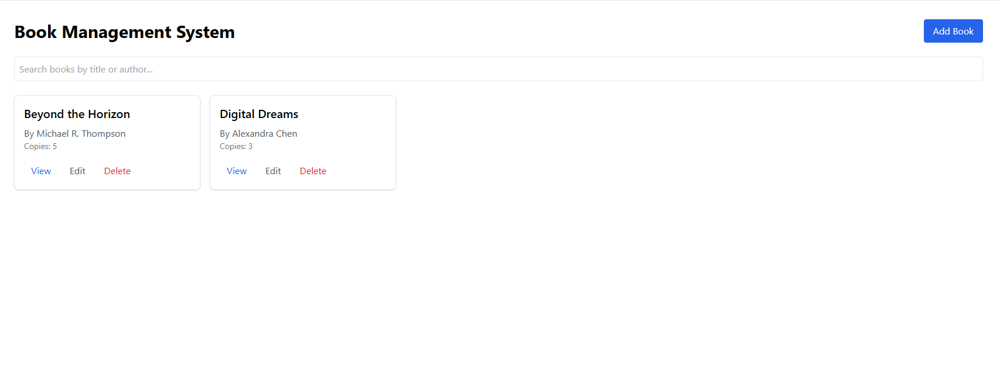

# Book Management System

This is a TypeScript-based project that includes a backend built with **Express** and a frontend built with **Vite + React + TailwindCSS**. The project allows users to manage books through a RESTful API and a user-friendly web interface.

---

## Backend Directory
The **backend** directory contains an Express server with CRUD operations for managing books.

### Endpoints

1. **POST `/books`** - Add a new book  
   **Request Body:**
   ```json
   {
     "title": "Book Title", 
     "author": "Author Name", 
     "id": "123-456-789", 
     "publishedDate": "YYYY-MM-DD", 
     "availableCopies": 5
   }
   ```

2. **GET `/books`** - Retrieve a list of all books.

3. **GET `/books/:id`** - Retrieve details of a specific book.

4. **PUT `/books/:id`** - Update book details

   **Request Body:**
   ```json
   {
     "title": "Book", 
     "author": "Author Name", 
     "id": "123-456-789", 
     "publishedDate": "YYYY-MM-DD", 
     "availableCopies": 5
   }
   ```

5. **DELETE `/books/:id`** - Delete a specific book.

---

## Frontend Directory
The **frontend** directory contains a React + Vite application styled with TailwindCSS.


## Getting Started

### Prerequisites
- Node.js v22.11.0
- npm v10.9.0

### Steps

#### 1. Clone the repository
```bash
git clone https://github.com/hilaitzhak/Book-Management-System.git
cd book-management-system
```

#### 2. Setup Backend
1. Navigate to the backend directory:
   ```bash
   cd backend
   ```
2. Install dependencies:
   ```bash
   npm install
   ```
3. Start the server:
   ```bash
   npm start
   ```
   > **Backend runs on `http://localhost:3000` by default.**

#### 3. Setup Frontend
1. Open a new terminal and navigate to the frontend directory:
   ```bash
   cd frontend
   ```
2. Install dependencies:
   ```bash
   npm install
   ```
3. Start the frontend:
   ```bash
   npm run dev
   ```
   > **Frontend runs on `http://localhost:5173` by default.**

---

## Directory Structure

```
book-management-system/
│
├── backend/
│   ├── src/
│   │   ├── controllers/
│   │   ├── interfaces/
│   │   ├── models/
│   │   ├── routes/
│   │   ├── services/
│   │   └── utils/
│   │   └── server.ts
│   ├── app.ts
│   ├── package.json
│   └── tsconfig.json
│
├── frontend/
│   ├── src/
│   │   ├── components/
│   │   ├── interfaces/
│   │   ├── App.tsx
│   │   ├── index.css
│   │   └── main.tsx
│   ├── tailwind.config.js
│   ├── package.json
│   ├── vite.config.ts
│   └── tsconfig.json
│
└── README.md
```

---

## Dependencies

### Backend
```json
"express": "^4.21.2",
"cors": "^2.8.5",
"typescript": "^5.7.2"
```

### Frontend
```json
"react": "^18.3.1",
"vite": "^6.0.1",
"tailwindcss": "^3.4.16",
"typescript": "^5.6.2"
```

---

## Screenshots



---